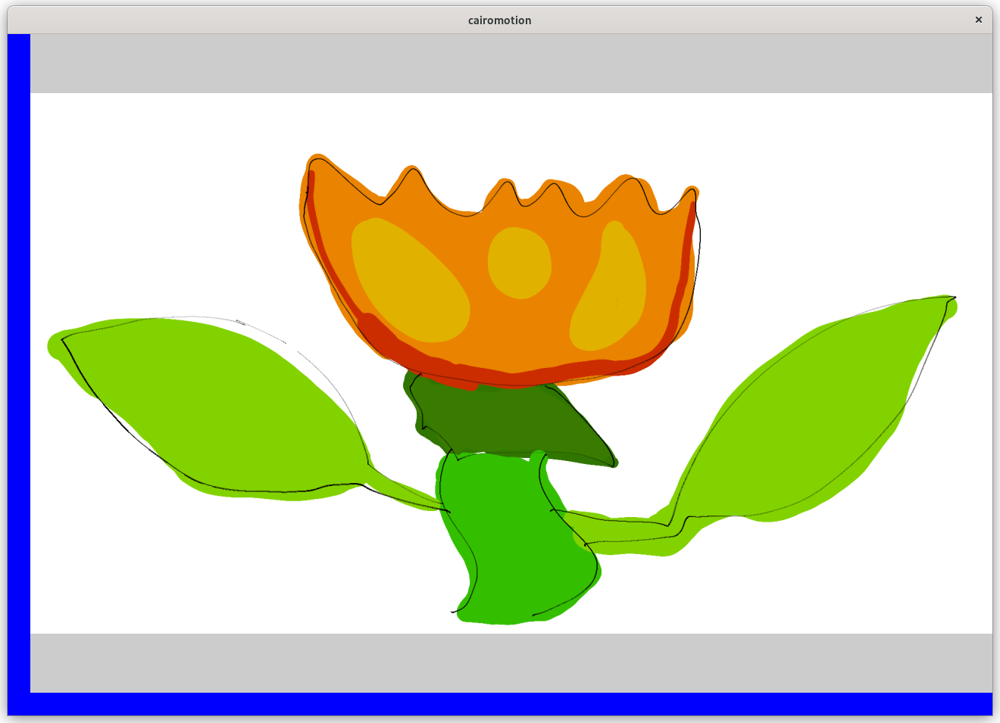
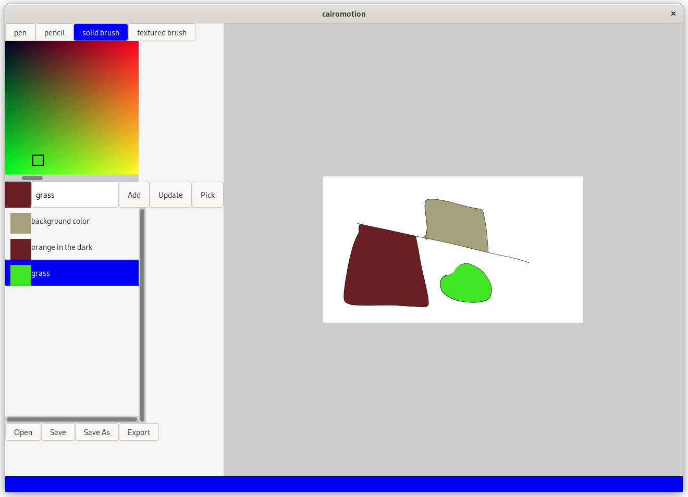
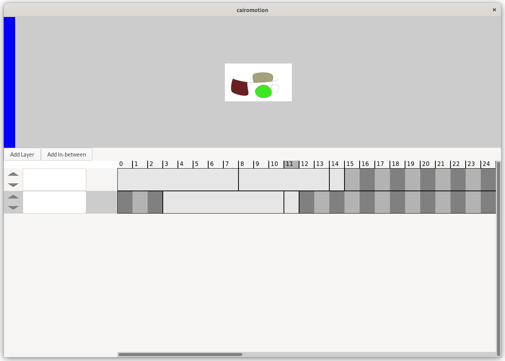

# Motion

An animation creator software made with GTK4.

## Documentation

When you open Motion, you can see a canvas and a blue bar on the left side and bottom side.

If you hover over your cursor on the left side bar, the tools pop up. Hovering over the bottom side bar, the timeline pops up.

The aim of this design is to give as much space to the canvas as possible. To further increase the canvas,
you can go fullscreen with F11. If you right-click anywhere the canvas, the popup bars toggle visibility,
maximising the canvas.

### Toolbar

In the toolbar, you can select your tool, which can be pen, pencil and solid brush. (Texture brush is not implemented yet).

Pen and pencil currently paints only black. When you select the solid brush, you can select the color of it.

The color chooser maps the RGB color in the following way: R and G channels are mapped as x and y coordinates and B channel
can be adjusted with the scrollbar.

You can save the colors in a list with a name with the Add button and update it with the Update button.

You can also pick a color from anywhere the monitor with the Pick button.

Save, open projects. The file extension of the Motion project file can be ".mpf".

Export the image sequence with the Export button to a folder.

### Timeline

Frames are added to the current time in the selected layer. If you move the time indicator further and start drawing, a new frame will be added and the previous frame is extended until the current frame.

Moving the frames is not yet implemented.

### Canvas

The size of the canvas is currently only 1920 x 1080 pixels. When you draw a line, it is the most smooth when the canvas has it's full size (fullscreened and no bars).

When you use the solid brush, it draws a thick line. If you press the middle button, it fills the area. So if you have a pen line that is not closed, you can close it with the solid brush and then fill the color.